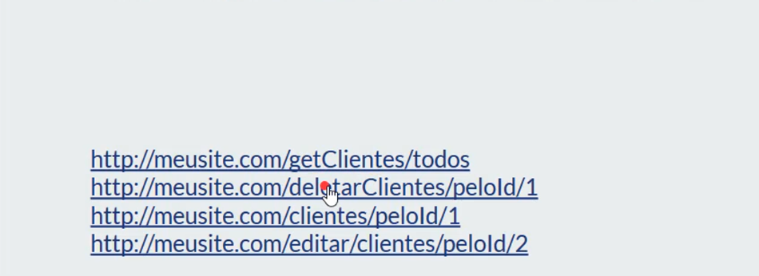
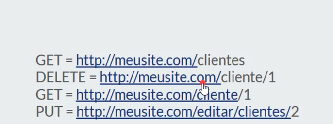
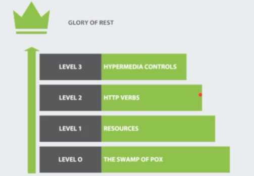

# Api Rest

#### Jeito Incorreto  ou Não uniforme 

#### Jeito Correto  ou Uniforme 

Api Rest = pode ser rest mas  não necessáriamente restful

Restful == Utiliza os 4 niveis

 ## LEVEL 0 => uma unica rota que retorna tudo
 ## LEVEL 1 => recursos organizados e dividos as rotas 
 ## LEVEL 2 => uso de verbos http correto no seu webservice
 ## LEVEL 3 => HATEOS alem do retorno , links de ações possiveis para o link
 